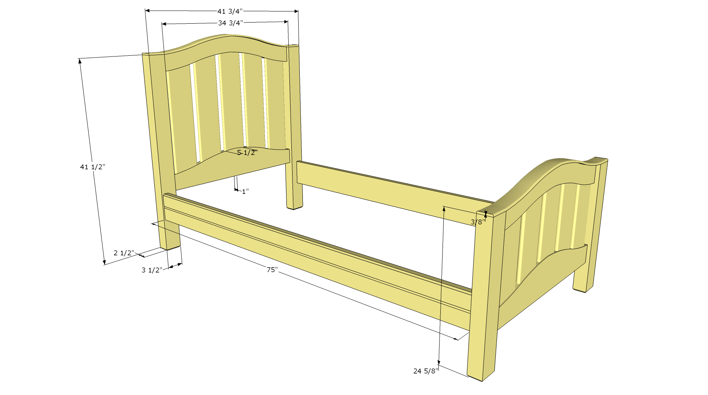

# arched-twin-bed
Design for a twin bed with an arched headboard and footboard

## Parts

|Part|Count|Dimensions|
|-----|-|-------|
|Side Rails|2|1 1/4" x 5 3/4" x 75"
|Headboard Legs|2|2 1/2" x 3 1/2" x 41 3/4"
|Head/Footboard Top Rail|2|1" x 6 1/2" x 34 3/4"
|Head/Footboard Bottom Rail|2|1" x 6 5/8" x 34 3/4"
|Head/Footboard Cap|2|3/8" x 2 1/2" x 44"
|Headboard Stiles|5|1/2" x 6" x 24"
|Footboard Legs|2|2 1/2" x 3 1/2" x 25"
|Footboard Stiles|5|1/2" x 6" x 15"

## Materials
|Length|Thickness|Width|Board Feet|Parts|
|--|--|--|--|--|
|14'|6/4"|6"|10.5|Side Rails
|12'|12/4"|4"|12.0|Legs
|12'|5/4"|7"|8.75|Rails
|22'|3/4"|6"|11.0|Stiles & Caps

## Steps
1. Create rail template
2. Mill and cut head/footboard rails
3. Mill and cut stiles
4. Mill and cut legs
5. Mill and cut caps
6. Mill and cut side rails
7. Assemble
